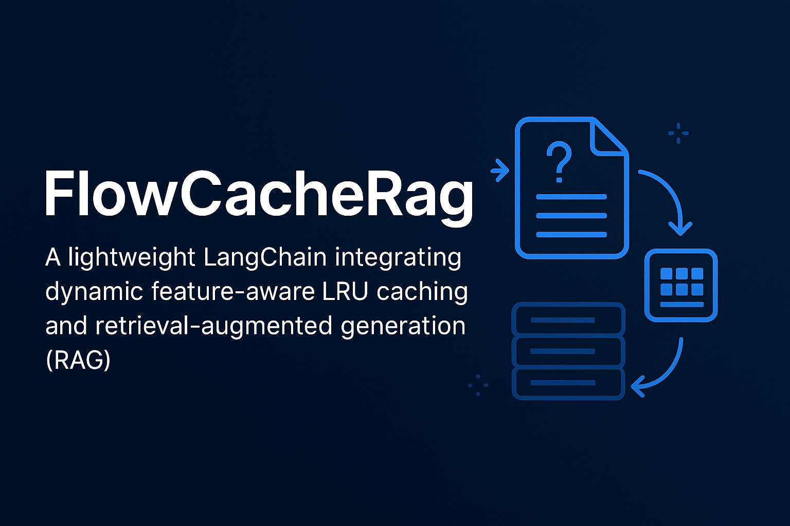
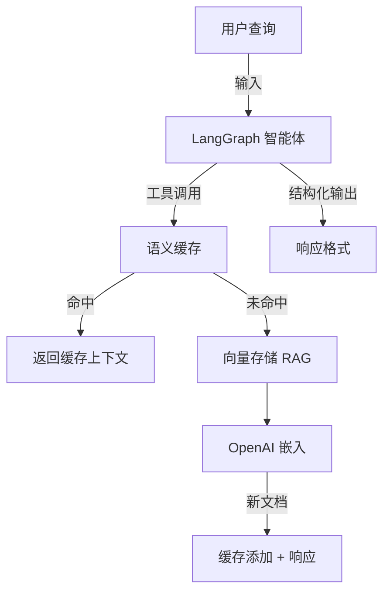
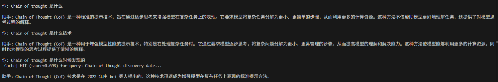

# 🧠 FlowCacheRag —— 具有语义缓存的 RAG 智能体 (LRU + 嵌入相似度)



> 🚀 这是一个轻量级的 **LangChain** 项目，集成了**动态特征感知的 LRU 缓存**、**向量检索 (RAG)**和检索增强生成（RAG）—— 优化用于**高效语义复用**和**低延迟上下文检索**。


---

## 🌟 主要特性

✅ **RAG 增强智能体**
- 使用 `InMemoryVectorStore` 从实际博客文章中进行语义检索
- 使用 `RecursiveCharacterTextSplitter` 嵌入和分割大型文档

✅ **自定义语义缓存**
- LRU（最近最少使用）+ 基于余弦相似度的缓存
- 智能缓存命中检测（可调节 `threshold`）
- 减少重复的嵌入和检索成本

✅ **LangGraph 集成**
- 使用 `InMemorySaver` 进行内存检查点
- 支持带有持久化上下文的*多轮*对话

✅ **结构化输出**
- 响应遵循严格的模式（`ResponseFormat`），确保结果整洁且类型安全

✅ **可扩展工具**
- `retrieve_context` — 具有缓存优先逻辑的混合检索
- `search_web` — 模拟搜索工具（可替换为 Tavily / Serper / DuckDuckGo）

✅ **专业设计**
- 模块化架构
- 类型注解 + 数据类，实现清晰的模式控制
- 兼容 `gpt-4-turbo` 或更高版本

---

## 🧩 系统架构



## 🧱 项目结构

```plaintext
.
├── 🚀 main.py                # 入口点（智能体循环）
├── 📝 .env                   # 环境变量（OPENAI_API_KEY）
├── 📦 requirements.txt       # 依赖项
├── 📖 README.md             # 文档说明
└── 📂 utils/
    ├── 🧠 semantic_cache.py  # 自定义 LRU + 嵌入缓存
    └── 🔄 loaders.py        # Web基础加载器
```

## ⚙️ 安装步骤

```bash
# 1️⃣ 克隆仓库
git clone https://github.com/yourusername/langgraph-rag-agent.git
cd langgraph-rag-agent

# 2️⃣ 创建环境
python -m venv venv
# Windows:
venv\Scripts\activate
# Linux/Mac:
# source venv/bin/activate

# 3️⃣ 安装依赖
pip install -r requirements.txt

# 4️⃣ 设置环境变量
# 创建 .env 文件并添加您的 OpenAI API 密钥
echo "OPENAI_API_KEY=sk-xxxxxx" > .env
```

## 📦 核心组件

| 组件 | 描述 |
|------|------|
| `SemanticCache` | 基于嵌入余弦相似度的 LRU 缓存 |
| `InMemoryVectorStore` | 存储分割文档的向量数据库 |
| `WebBaseLoader` | 用于检索的网页内容爬取器 |
| `RecursiveCharacterTextSplitter` | 将长文档分割为语义块 |
| `ResponseFormat` | 强制实施结构化 LLM 输出的数据类 |
| `InMemorySaver` | 用于对话线程的 LangGraph 内存检查点 |

## 🧩 语义缓存示例

```python
cache.stats()
# {'capacity': 128, 'entries': 7, 'threshold': 0.3}

# 缓存命中时：
[Cache] HIT (score=0.91) for query: "LangChain memory"...
```

## 🧰 依赖项

| 库 | 版本 | 用途 |
|------|--------|---------|
| `langchain` | 最新版 | 智能体和工具编排 |
| `langgraph` | 最新版 | 基于图的智能体执行 |
| `langchain_openai` | 最新版 | 嵌入和聊天模型 |
| `numpy` | ≥1.25 | 向量数学计算 |
| `beautifulsoup4` | ≥4.12 | 网页解析 |
| `dotenv` | ≥1.0 | 环境变量加载 |

## 📸 预览

